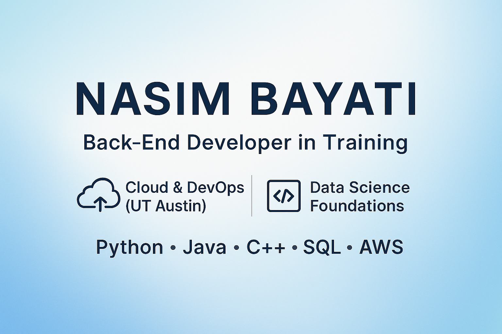

  

# 👩‍💻 Nasim Bayati

**Software Development Student | Back-End Developer in Training | Data & Cloud Enthusiast | Python, Java, SQL**

---

🎯 **About Me**

Hi! I’m **Nasim Bayati**, a detail-oriented and passionate software development student based in Round Rock, TX.  
I am pursuing my **Bachelor of Applied Science (BASc) in Software Development** at Austin Community College and building skills to become a **Back-End / Cloud Developer**.  

- 🔹 Strong foundation in **Python, Java, C++, and SQL**
- 🔹 Hands-on experience with **Oracle Database, SQL Server, and PL/SQL**
- 🔹 Skilled in **data handling, reporting, and visualization**
- 🔹 Familiar with **AWS & GCP fundamentals** and Linux/Unix systems
- 🔹 U.S. Permanent Resident (Green Card) — ✅ **No sponsorship required**
- 🔹 Open to **internships, projects, and collaboration opportunities**

---

🛠️ **Technical Skills**

- **Languages**: Python (NumPy, Pandas, SciPy), Java, C, C++, PL/SQL, SQL  
- **Databases**: Oracle SQL Developer, MS SQL Server, Relational Databases  
- **Data Work**: Data Cleaning, Data Reporting, Data Visualization  
- **Cloud**: AWS & GCP Fundamentals  
- **Systems**: Linux, Unix  
- **Tools**: Git, GitHub, Jupyter Notebook, MS Office Suite  
- **Other**: Agile Project Management, Scientific Python  

---

📚 **Current Learning Goals**

- 🚀 Advancing in **Back-End Web Development**
- ⚡ Learning **Flask** & modern **API development**
- 🗄️ Improving **SQL/PLSQL optimization & advanced database management**
- 🌩️ Building stronger knowledge in **Cloud & DevOps tools**

---

📂 **Featured Projects**

- [🚦 Dangerous Intersections Crash Risk App](https://github.com/nasimbayati/dangerous-intersections) — ML-powered Flask app predicting crash risk using Austin traffic data.  
- [📊 Statistical Analyzer](https://github.com/nasimbayati/statistical_analyzer) — Python package for basic & advanced statistical operations.  
- [📈 Styled Dashboard](https://github.com/nasimbayati/styled_dashboard) — Interactive dashboards for clean, customizable data analytics.  
- [📚 Basic Data Tools](https://github.com/nasimbayati/basic_data_tools) — Modular Python utilities for data manipulation & reporting.  

---

📬 **Let’s Connect**

- 🌐 [GitHub](https://github.com/nasimbayati)  
- 💼 [LinkedIn](https://www.linkedin.com/in/nasim-bayati-13359575/)  

---

⭐ _Always learning. Always improving. Let’s build something great together!_
